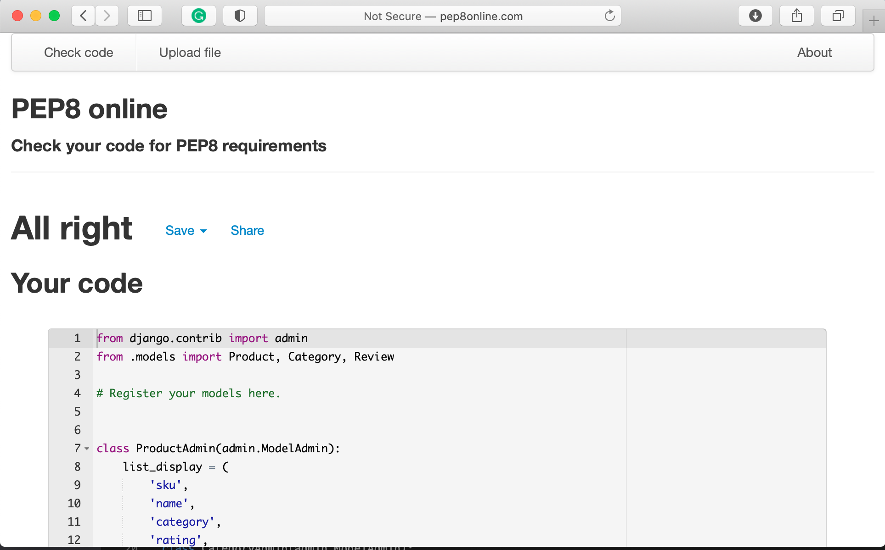

# **Tea People**
[View a live version of Tea People here]()
This is the main website for *Tea People*. An. eccommerce site selling tea and tea tasting. 
 "Tea People on multiple displays"

## Table of Contents
### [User Experience](#user-experience-(ux))
### [Project Goals](#project-goals)
#### [User Stories](#user-stories)
* [First Time Visitor Goals](#first-time-visitor-goals)
* [Returning Visitor Goals](#returning-visitor-goals)
* [Frequent Visitor Goals](#frequent-visitor-goals)

### [Design](#design)

* [Color Scheme](#color-scheme)
* [Typography](#typography)
* [Imagery](#imagery)
* [Features](#features)
* [Defensive Design](#Defensive_Design)
* [Wireframes](#wireframes)
### [Technologies Used](#technologies-used)
* [Languages Used](#languages-used)
* [Frameworks  Libraries and Programs Used](#frameworks-libraries-and-programs-used)
### [Deployment](#delpoyment)
* [GitHub](#github)
* [Cloning to Local Device](#cloning-of-repository-to-a-local-device)
* [Setting up a google maps javascript API](#Setting-up-a-google-maps-javascript-API)

### [Testing](#testing)
### [User Stories] (#)
[Photo story for first time user](#photo-story-for-first-time-user)
[Bugs](#bugs)
- [Gallery](#gallery)
- [Navbar](#navbar)
- [form](#form)
- [Javascript for Maps](#javascript-for-maps)
- [Javascript for mail](#javascript-for-mail)
### [Acknowledgements](#acknowledgements)
* [Media](#media)
* [Individuals](#individuals)

## User Experience (UX)

### Project Goals 

 * A website that allows user full CRUD(Create, Read/Locate , Update and Delete) functionality. 

 * Site will use HTML, CSS, jQuery, Python, Flask and MongoDB.

 * Website will provide Users the chance to login, create and edit website. 

 * A user friendly website.

 

#### First Time Visitor Goals
 
 1. A first time user will be able to visit the site on any device. 
 
 2. A first time user will register their account.
 
 3. After registering their account the can then add a recipe, edit a recipe and search for recipes using ingredients. 

 #### Returning Visitor Goals

 1. Will be able to login to their account. 

 2. They can also search for new recipes, add new recipes and edit old recipes. 

 #### Frequent Visitor Goals.

 1. Learn new recipes.

 2. Continue to add to their recipe book. 

 3. Double check recipes when making dinner on your mobile. 

# Design 
  ## Color Scheme  
  * Three main colors where chosen. Black backgrouund on landing page. and White background, black font like a notebook and teal buttons. 
  
  * Red button for deletion warning.
   
 ## Typography 
    
  * Font used is Permanent Marker and Cursive for logo and Lato for the main body.  Permanent Marker is a nod to. thee Neon sign on the landing page.

 ## Imagery
  * Images used were from Unsplash.
  
## Features
* Responsive on all devices. Allows users to work shop for tea online.  Allowing Icons that link to further social media updates.

## Defensive Design

* The user must log in or register to see the full recipes. 

* Passwords are used with WerkZeug to protect the user. 

* You can only add, edit and delete your own recipes. 

* The passsword must contain between 5-20 characters. 

* Recipes must also contain characters. 

* Image Url must contain http:// or https://.

## Database Schema 

 "Sample of Schema for database."

## Wireframes

* Wireframe for the whole project. [View]()

# Technologies Used 
## Languages Used 
* HTML
* CSS
* Jquery
* Python
## Frameworks Libraries and Programs Used 
1. [Materializecss](https://materializecss.com/)
  
    Materialize CSS

2. [Heroku](https://dashboard.heroku.com/apps)

    Used to deploy app. 

3. [MongoDB](https://account.mongodb.com/account/login?signedOut=true)

    Database usedto store recipes and site info.  

4. [Google Fonts](https://fonts.google.com/specimen/Pacifico?preview.text=Pacifico&preview.text_type=custom&query=Pacifico)

    Pacifico font used.
5. [Fontawesome](https://fontawesome.com/)
    Fontawesome was used for to get icons for utensils and aa cocktail on the feast page. 
6. [Gitpod](https://gitpod.io/workspaces/)
    Used gitpod to work on my repositories. 
7. [Github](https://github.com/MichelleCoffey/A_Moveable_Feast_Shanghai/tree/1a91746d21707106faef91c699500aff9414e097)
     GitHub is hosting my repositories. 
8. JQuery: 
    * Used for materialize

9. [Balsamiq](https://balsamiq.com/)
    * Balsamiq was used to design and organise my WireFrames. 
10. [TinyPNG](https://tinypng.com/)
     * Tinypng for fomatting images, so they loaded faster.
11. [Unsplash](https://unsplash.com/)
    * Upsplash was used to access some stock images to add to the site and in particular the hero image and background image. 
12. [Shutterstock](https://www.shutterstock.com/)
    * Shutterstock was used for the heroimage. 
13. [BBC FOOD](https://www.bbc.co.uk/food)
    * Recipes.

14. [Werkzeug](https://werkzeug.palletsprojects.com/en/2.0.x/)

    Used for security and passwords. 

15. [RandomKeyGen](https://randomkeygen.com/)

## Deployment 
### Github

### Requirements 
  1. Python3 
  2. Github account
  3. Mongo db account
  4. Flask 
  5. heroku account

#### The repository is hosted on GitHub but deployed on Heroku
To make a local clone on Github, follow the following steps.

1. Log in to GitHub and go to the repository.
2. Click on the green button with the text “Code”.
3. Click on “Open with GitHub Desktop” and follow the prompts in the GitHub Desktop Application for instructions.     
4. For further options and documentation please click [here](https://docs.github.com/en/repositories/creating-and-managing-repositories/cloning-a-repository#cloning-a-repository-to-github-desktop).
  
#### Working with the local copy.
  1. Install all of the requirements. In the terminal window of your IDE type

     **pip3 install -r requirements.txt**

  2. Create a databae in Mongo db. 
      * Sign up or login. 
      * Create a cluster and a database. 
      * Create cluster for family_recipes and in it create a further three collections: user, categories, and recipes. Add string values for each. 
  3. Create the variables. 
    * Create a env.py file by typing **touch env.py**
    * Create a gitignore file and add the env.py to the gitignore to ensure that any passwords are not visible in the github repository. 
    * Add environment variables in the env.py

            
              os.environ.setdefault("IP", "Added by developer")
              os.environ.setdefault("PORT", "Added by developer")
              os.environ.setdefault("SECRET_KEY", "Added by developer")
              os.environ.setdefault("MONGO_URI", "Added by developer")
              os.environ.setdefault("MONGO_DBNAME", "Added by developer")

   
          
    #### Heroku Deployment

    This project was deployed using Heroku. Heroku is a PAAS (platform as a service) that enables developer to build, run and operate applications entirely in the cloud. Heroku integrates with GitHub to make it easy to deploy code living on GitHub to apps running on Heroku.

    1. In the terminal you must first need to create two files.
     **pip3 freeze -- local > requirements.txt**
      Followed by 
     **echo web: python app.py > Procfile**
      These are needed for Heroku. 
    2. Sign in or create a Heroku account. 
        * Click 'New' on the dashboard and select 'Create new app'.
        * Provide a unique app name including dashes, select your region, and   click  **'Create App'**.

    3. Go to **delpoy** tab on the dashboard.
       * For the **deployment method** click **Github**
       * Provide your repository name and click **Search**, once it finds your repository, click **Connect**.
       * Click on **Settings** and then the **Reveal Config Vars** to provide your **environment variables** from your **env.py** file to **Heroku**:
       
        ENTER IP, PORT, SECRET_KEY, MONGO_URI, MONGO_DBNAME.

    4. Return to your git terminal and Push **requirements.txt** and **Profile**.
        $ git add requirements.txt
        $ git commit -m "Add requirements.txt file."
        $ git add Procfile 
        $ git commit -m "Add procfile."
        $ git push
    5.  Return to **Heroku** and click the **deploy** tab. 
        Then click on **Enable Automatic Deployment** followed by **Deploy Branch (main)**
        This will take less than a minute. Once your receive the success note. Click **view** to see your live site. 
    

                            
## Testing 

### Photo story for first time user

### User Stories Testing 

#### First Time User 

  "Family Recipes on multiple displays."

 * User arrives at site and is guided to register. They must register name and password. They are prompted to add letter and not leave blank. 

  "Family Recipes register page."

 * After registering the user lands on the profile page and allows user to view recipes or add their own. 

   "Family Recipes profile page."

  * User looks at recipes and searches for valid recipes. Example entering flour will give you different cakes.

  "Family Recipes profile page."

 * This allows them to search.

   "Family Recipes profile page."

  The user can then look at the full recipe and see ingredients listed and whether or not it is gluten free. 

   "Family Recipes profile page."

  While searching the navbar or return ing to the profile the user can add their own recipe.

   "Family Recipes profile page."

  The user may fill in the form and add their recipe. They can also use the url image option or use the default image. 

  The user may also delete or edit their own recipes on the full recipe page. Once completed the user may log out.

  All links are working appropriately and leading the user easily around the site. 

## Code Testing

W3C CSS Validator Services was used to validate CSS.

 "CSS Validation."
 * This was successful.

  "Pep8 Python testing."
 * This was successful but there was white space on blank like that would not change.

 "Home Page HTML success."

 "Lighthouse score for the websites user efficency."

### Bugs
#### Mongodb

1. The trickiest part is connecting mongodb and to gitpod. The main issue is knowing where to add the name and password to your MONGO_URL. This seemed to have a delayed response for me as it did not initial work but worked the following morning. I use a VPN in China and can cause some glitches. First test didn't work because I had missed a closing " in my html. Once rectified it all worked and stored info in the databases.

#### Images and form
* After adding a flex component to css this cause my images to distort. I removed the flex to specific areas instead. 

 #### Form 
 * The form pushed left on small devices. I removed the width of 400px, which helped and then targeted the media query on larger devices. 

 #### Home Page
 * I had a link to the recipes which allowed the user to bypass login and register. I removed this from the site. 

## Acknowledgements
### Media
* Code Institute Tutorials for providing a jumping off block. 
 * Slack for being a great source of help with either googling or when other students have provided suggestions to help improve your work. 
 * Code Institute Tutorials. 

 ### Individuals
 * My Mentor, Precious Ijege. 
 * Tutors at Code Institute are great guiding hand.   They do not give you the answer but ask the right questions to lead you down the correct path. It also helps build confidence. 
 * Anne Greaves and Code Institute for a comprehensive guide to writing README.md. The template was taken from the Code Institute Guide to writing README and how to write Markdown.

 * Juan Stelling - breaktasty for a thorough README. I used elements of his and Anne Greaves README. 

 * Alex Harvey, a guide to writing a table of contents in gitpod. 

#### Code
  

 [Tim Nelson Task Manager](https://github.com/Code-Institute-Solutions/TaskManagerAuth)

 * This was used as the template for creating and connectimg my own python, mongodb database. 

 * Peer Code for ideas and examples implementation.

 * Lazy Vegan for how to deal with images in the database by  Jenny Malone.

 * Juan Stelling and breaktasty the ingredients section how to split the ingrediemts into lines. 

 ### Credits 

 

 * Parallax template from materialize for home page.

